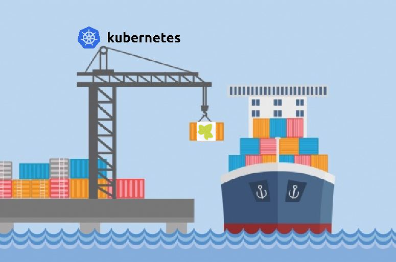

# Axon Ivy Kubernetes Samples



This repository shows you different [Kubernetes](https://kubernetes.io) setups with ivy.

All samples are based on the official [Axon Ivy Engine Docker Image](https://hub.docker.com/r/axonivy/axonivy-engine/).

## minikube

If you don't have a Kubernetes cluster available, you may install
minikube by following theses instructions.

1. Install minikube https://minikube.sigs.k8s.io/docs/start
2. Install kubectl https://kubernetes.io/docs/tasks/tools/
3. Start minikube `minikube start`
4. Show dashboard `minikube dashboard`

Hint: [Docker Desktop includes a standalone Kubernetes server and
client](https://docs.docker.com/desktop/features/kubernetes/).

## Namespace

Everything in Kubernetes lives in a Namespace. If you playaround
with this examples, you may create an own namespace and switch
to that namespace.

```bash
# Create a new namespace `sandbox`
kubectl create namespace sandbox

# Switch to namespace `sandbox`
kubectl config set-context --current --namespace=sandbox

# Show all namespaces
kubectl get namespaces

# Delete namespace `sandbox`
kubectl delete namespace sandbox

# Show current namespace
kubectl config view --minify --output 'jsonpath={..namespace}'
```

## Run

Switch in a directory of your choice

    cd ivy

And read the `README.md` in that directory.


## License

All these samples are shipped with a limited demo license. You are able to run the portal application.

> [!NOTE]  
> All credentials in this repository are for demo purposes and must be changed when used in production.
> Please do not report any of these in the bug bounty program.

## Docker Samples

Also have a look at our [docker samples](https://github.com/axonivy/docker-samples)
